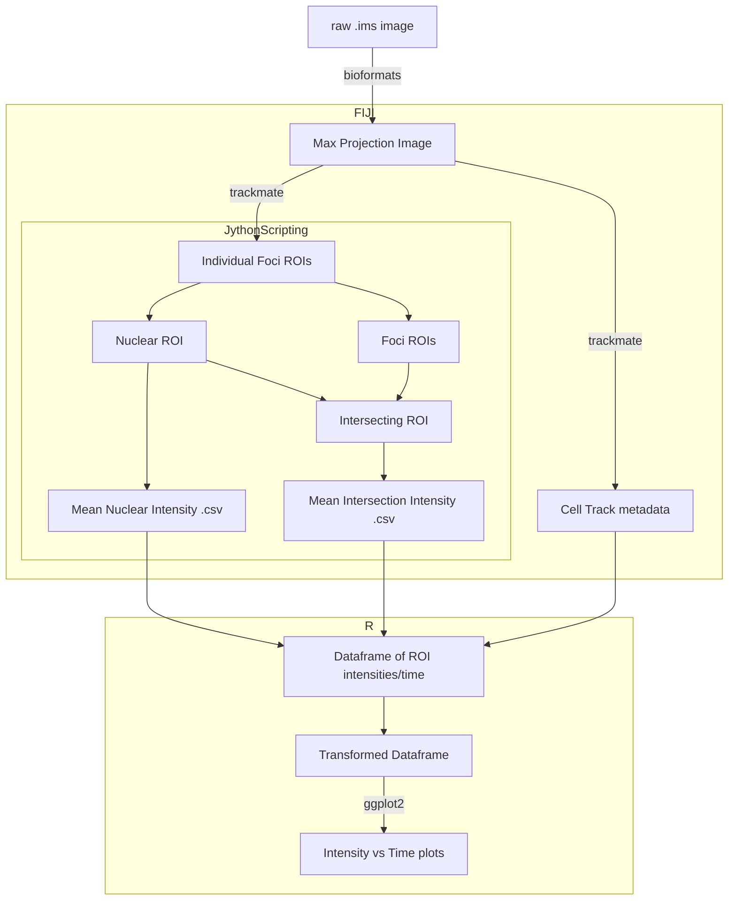
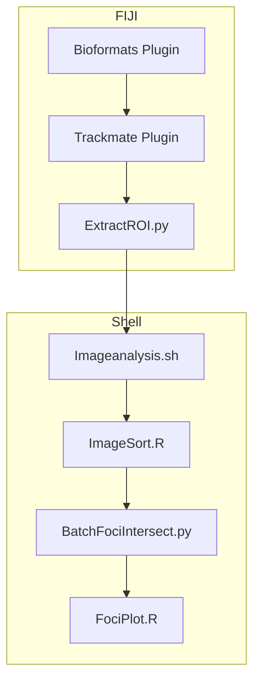

## Script workflow




## Running enviroment




#========================================================================


## Running steps

1. Import/open image in FIJI

3. Select ROI boundary (*will ensure that all identified ROIs will not be straddling the boundary of the image*)```
``` java
//setTool("rectangle");
makeRectangle(50, 50, 924, 924);
```
3. Run Trackmate

Trackmate Params:
##############################################

	1. . Image parameters
		1. X (0, 1023)
		2. Y (0, 1023)
		3. Z (0, 0)
		4. T (0, 59)
	2. LoG detector
		1. Detect in channel: 3 (lacO)
		2. Estimated object diameter: 0.5
		3. Quality Threshold: 50(Confocal) - 200 (TIRF)
	3. Select all for initial thresholding
	4. For filters
		1. Contrast Ch3 (place the lower limit of the gate at the beginning of the plateau)
	5. LAP Tracker
		1. frame-to-frame linking 
			1. max distance: 1.0 micron
		2. Segment closing gap:
			1. max distance: 1.0
			2. max frame gap: 3
	6. Filters on tracks:
		1. TrackDisplacement: ~0-1.8
		2. TrackStart: 0 *Must be visible and measurable at time = 0, to synchronize measurements*
		3. TrackStop: ~45-50
	7. Open *Tracks* tab, select all tracks, press *Export to csv*
	8. In trackmate menu, select *Export spots to IJ ROIs

##############################################

4. Open ExtractROI.py in FIJI (*Do not touch FIJI as this script opens, writes, and closes continuously which may lead to closing the wrong image*)
	1. Select output directory for individual images
	
5. Copy ImageAnalysis.sh into the working directory 
	1. Place the following sub-scripts somewhere on the system (make a note of the path). Edit the corresponding paths in the Imageanalysis.sh script
	
			ImageAnalysis.sh
				-imageSort.R
				-BatchFociIntersect_v4.py
				-FociPlot_v2.R
				
				
6. Open terminal and run ImageAnalysis.sh from the working directory
``` shell
	bash ImageAnalysis.sh
```

7. Select output target output directory, Run script.

8. Done


## Output

the Resulting directory should have the following folder structure:

``` shell
Experiment Folder/
			Export.csv
			ImageAnalysis.sh
			Original_maxProj.tif
			ROIs/
				N_cellID/
					N_cellID_stack.tif
					N_cellID_IntensityTrace.png
			Outputs/
				AvgCell_intensity.csv
				log.txt
				PerCell_intensity.csv
				ROI_values.csv
				Figures/
					FirstSlope.png
					FociInt_Ch1.png
					FociInt_Ch2.png
					MaxIntensityPlot.png
					Rplots.pdf
					econdSlope.png
		
